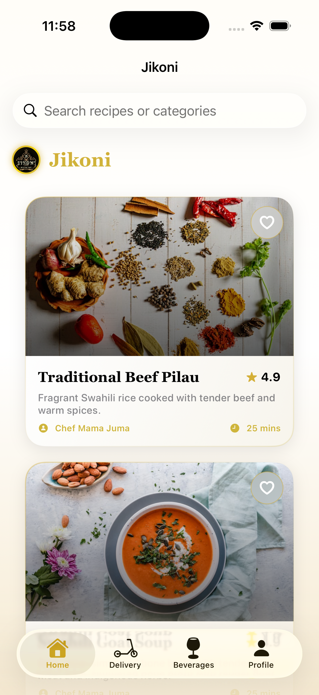
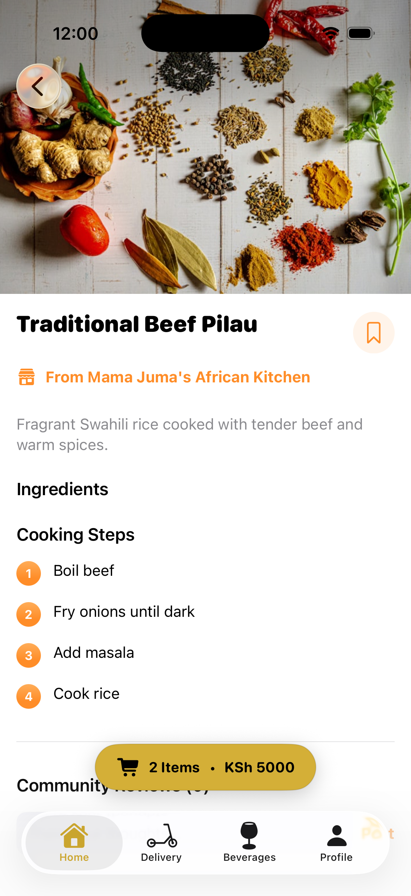
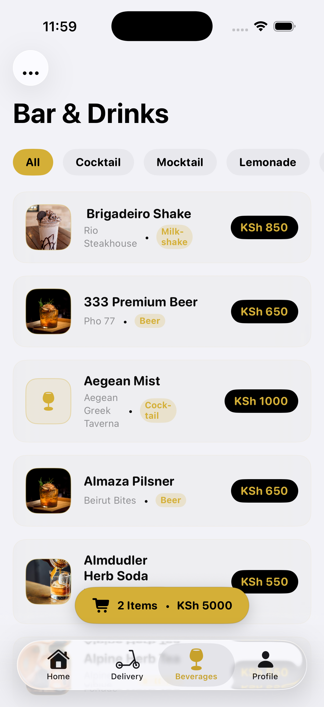
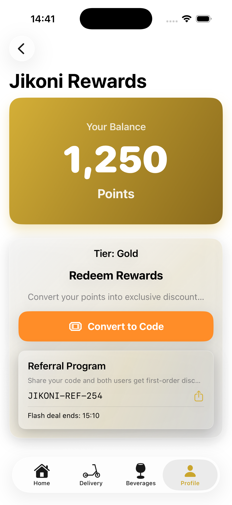
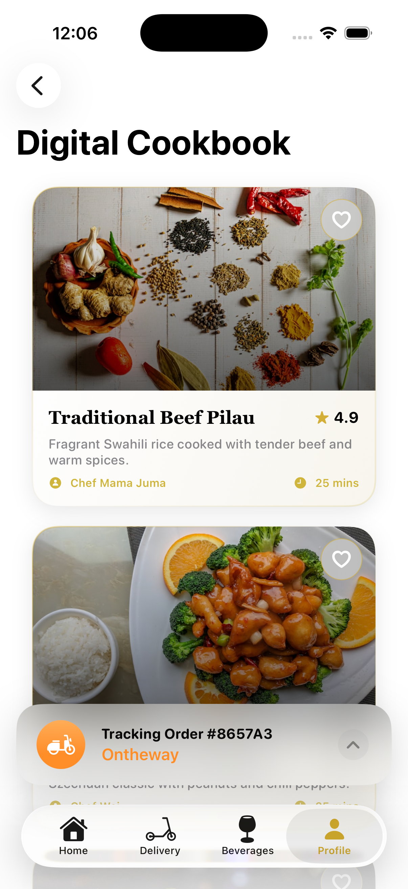
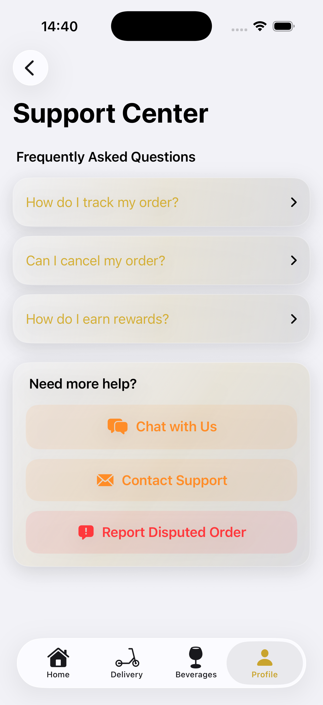

# Jikoni

**Jikoni** is a high-fidelity iOS application designed to bridge the gap between home-cooked inspiration and local luxury commerce. It serves as a premium food economy platform where users can discover global recipes, order artisanal ingredients, and track deliveries through upscale districts.

## Key Features

### Sign Up, Home Page and Restaurants
New users are onboarded quickly, then guided into a curated home feed and nearby restaurant discovery flow.
<p align="center">
  
  
  
</p>

### Restaurant Info
Restaurant pages are structured for conversion with clear information, trust-building reviews, and menu-first browsing.
<p align="center">
  
  
  
</p>

### Menus
Users can move from high-level meal browsing into dish-level detail and a dedicated drinks experience.
<p align="center">
  
  
  
</p>

### Ordering
The purchase journey is continuous from cart confirmation through live tracking and historical order records.
<p align="center">
  
  
  
</p>

### Customer Retention
Saved preferences and favorites create a faster repeat-order loop and stronger retention behavior.
<p align="center">
  
  
  
</p>

### Settings
Users can manage payment, profile, and app-level settings from a centralized control experience.
<p align="center">
  
  
  
</p>

### FAQ
Frequently asked support and account setup information in one place.
<p align="center">
  
  
  
</p>

## Technical Stack
*   **Language:** Swift 5.10
*   **Framework:** SwiftUI (Observation Framework)
*   **Architecture:** Clean Architecture (Domain, Data, Presentation)
*   **Project Management:** [XcodeGen](https://github.com/yonaskolb/XcodeGen)
*   **Maps:** MapKit with realistic route simulation logic.

## Getting Started

1.  **Clone the Repository:**
    ```bash
    git clone https://github.com/sirbor/Jikoni.git
    ```
2.  **Generate the Project:**
    Ensure you have `xcodegen` installed, then run:
    ```bash
    xcodegen generate
    ```
3.  **Open in Xcode:**
    ```bash
    open Jikoni.xcodeproj
    ```
4.  **Run:** Select an iPhone 15/16/17 Simulator or a physical device and press `Cmd + R`.

---

*Developed by Dominic Bor.*
