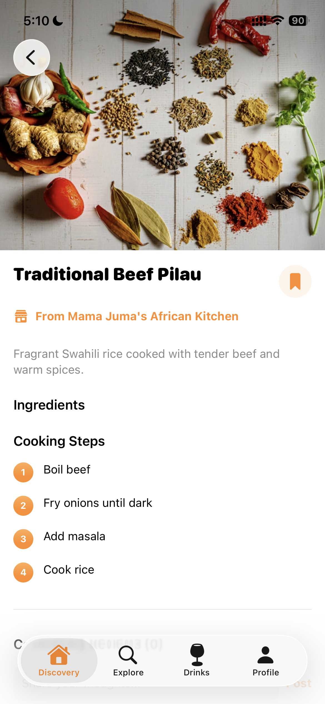
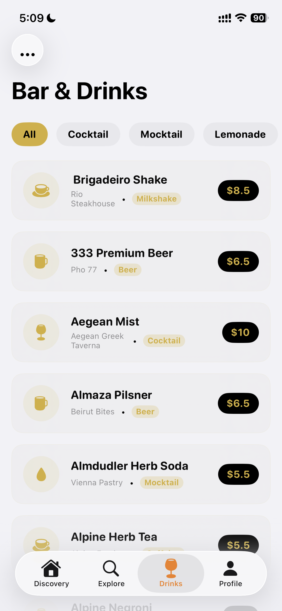
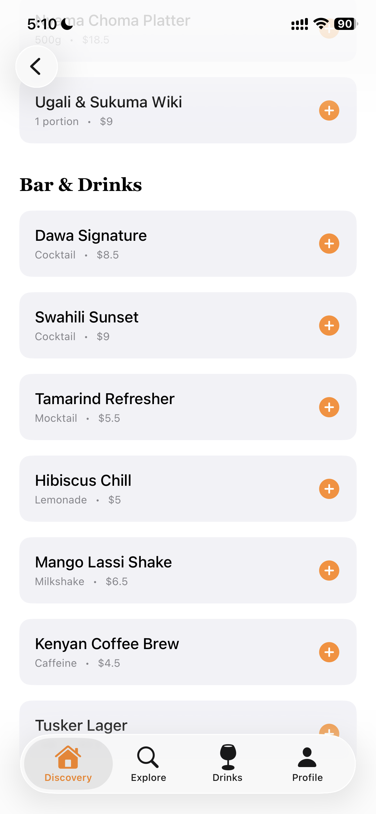
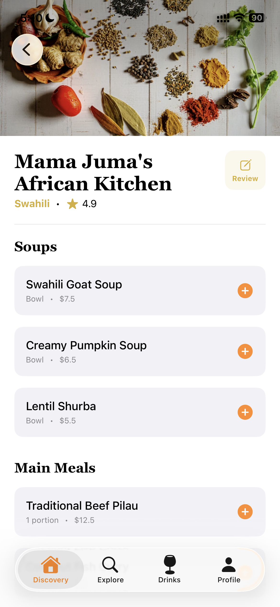
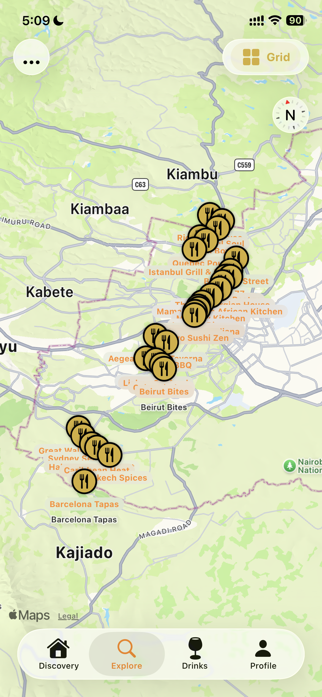
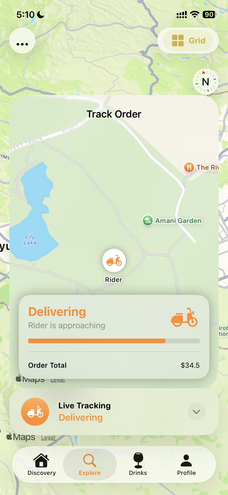
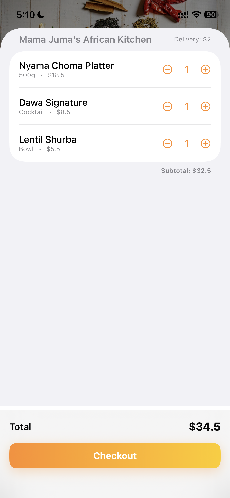
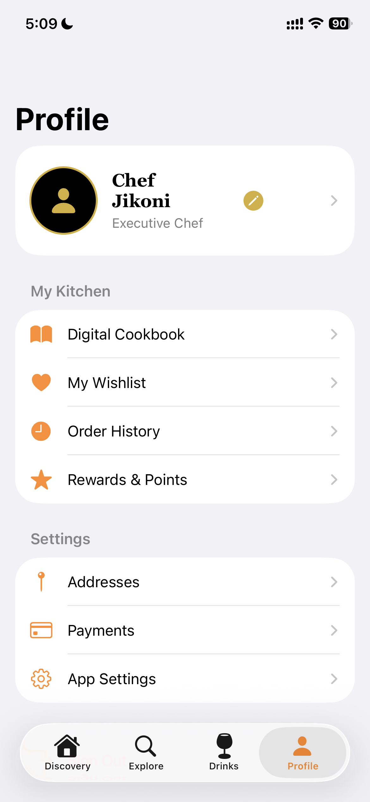
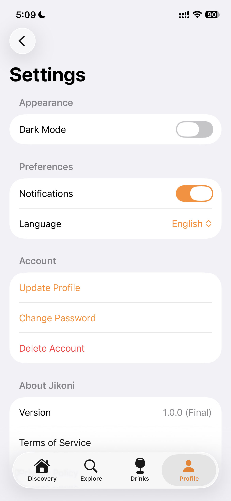

# Jikoni (iOS)

**Jikoni** (Swahili for "Kitchen") is a high-fidelity iOS application designed to bridge the gap between home-cooked inspiration and local luxury commerce. It serves as a premium food economy platform where users can discover global recipes, order artisanal ingredients, and track deliveries through upscale districts.

<p align="center">
  
  
  
</p>

## ✨ Key Features

### 🌍 Global Culinary Catalog
Discover 30 unique global cuisines, from **Spicy Kung Pao** and **Turkish Adana Kebab** to **Egyptian Koshary**. Each recipe is showcased with high-resolution imagery and detailed cooking instructions.
<p align="center">
  
</p>

### 🍸 Premium Drinks Ecosystem
A dedicated bar experience featuring artisanal **Cocktails, Mocktails, Milkshakes, and Caffeinated brews**. Browse the local "Drinks" marketplace with situational floating cart access.
<p align="center">
  
  
</p>

### 📍 Posh District Marketplace
Shop from 30 boutique vendors strategically located in upscale districts including **Muthaiga, Runda, Westlands, Lavington, and Karen**.
<p align="center">
  
  
</p>

### 🚚 High-Fidelity Delivery Tracking
Experience realistic real-time tracking. Our delivery simulation follows multi-node routes through premium neighborhoods, ensuring you see the exact path of your order.
<p align="center">
  
  
</p>

### 👤 Personalized Kitchen Hub
Manage your identity with profile editing, view your **Order History**, and access your **Digital Cookbook** and **Wishlist** all in one place.
<p align="center">
  
  
  
</p>

## 🎨 Design Philosophy
*   **Premium Gold Aesthetic:** A unified luxury theme using gold gradients, brass accents, and the **Georgia-Bold** serif font.
*   **Glassmorphism:** Extensive use of `ultraThinMaterial` for modern, immersive UI components.
*   **Situational UX:** A decentralized floating cart that appears only when you need it, ensuring a clutter-free browsing experience.

## 🛠 Technical Stack
*   **Language:** Swift 5.10
*   **Framework:** SwiftUI (Observation Framework)
*   **Architecture:** Clean Architecture (Domain, Data, Presentation)
*   **Project Management:** [XcodeGen](https://github.com/yonaskolb/XcodeGen)
*   **Maps:** MapKit with realistic route simulation logic.

## 🚀 Getting Started

1.  **Clone the Repository:**
    ```bash
    git clone https://github.com/sirbor/Jikoni.git
    ```
2.  **Generate the Project:**
    Ensure you have `xcodegen` installed, then run:
    ```bash
    xcodegen generate
    ```
3.  **Open in Xcode:**
    ```bash
    open Jikoni.xcodeproj
    ```
4.  **Run:** Select an iPhone 15/16/17 Simulator or a physical device and press `Cmd + R`.

---

*Developed by Dominic Bor.*
